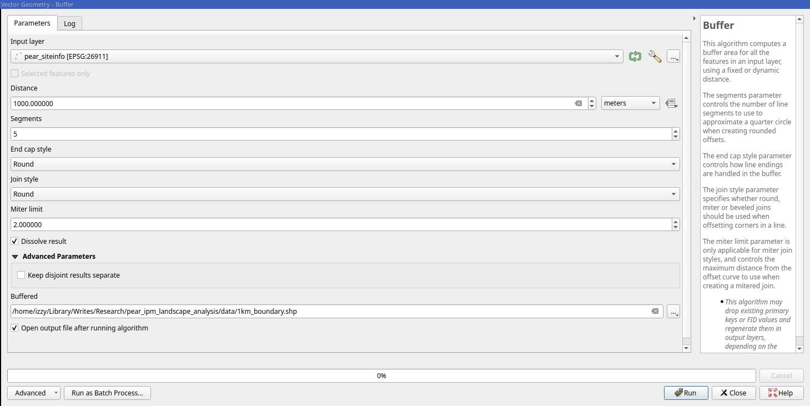
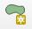
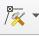

# Instructions for IPM analysis
Izzy McDonald (israel.mcdonald@wsu.edu)

## Introduction
This repository contains the required code and file structure to analyze pear IPM study data and the landscape management factors effects on
pear pest populations as collected in the study data. The landscape analysis design is a standard multi-ring buffer approach, where non-overlapping
zones of specified width are generated around a feature of interest, and landscape statistics within each of those buffers are calculated, allowing
for analysis to be done on the relationship between landscape statistics, data collected on the features of interest, and buffer distances. For an
example of this sort of analysis in practice, please see the following study: 
[https://www.mdpi.com/2072-4292/13/13/2551](https://www.mdpi.com/2072-4292/13/13/2551).  

This README contains instructions and specifications as to the formatting of data for use with the included Analysis.Rmd file, which provides
automatic data cleaning and a function to calculate the buffer and zonal statistics.  

You will require and up-to-date version of R, along with the packages `terra`, `sf`, the `tidyverse`, `tidyterra`, `basemaps`, `plotly`, and `furrr`. 
You will also require the free and open source program QGIS, or some other software to create and annotate polygon data in a shapefile.
  
## Site location and management data
The first piece of data to properly format is a .csv file containing study site codes, locations, and per-year management annotations.  

There should be a numeric column named `Code` that has numbers corresponding to the pest collection data. These act as primary keys
connecting the location and management data in this file to insect data in other files.  

There should be an arbitrary number of boolean (true/false) columns named by a year (2022, 2023,...). For each site in this column, it
should be 'true' if the site was conventionally managed in that year, and 'false' if it was organically managed or managed according to
IPM practices.  

The last two columns should be named `x` and `y` respectively (and in that order), and contain easting and northing coordinates in the 
EPSG:26911 (NAD83 UTM11) coordinate reference system. It is likely the site coordinates you have are in degrees of 
latitude and longitude (in the WGS 84 CRS and datum). If this is the case, enter your R console and source the provided
`transform_crs.R` file. It provides as function named `transform_to_utm11()` that takes a file path to a csv file formatted as specified
above and transforms the `x` and `y` columns from lat/long into UTM11. Write this properly formatted and transformed data frame to
the `data/` folder inside this project as `pear_siteinfo.csv`. 
  
## Landscape annotation
The second piece of data you will need is a shapefile (.shp) containing polygons and an associated attribute table that annotates those
polygons for the type of management by year. The three management codes are `CONV`, `ORG`, `IPM`, and `UNKN`, corresponding to conventional,
organic, IPM, and unknown management types respectively. All agricultural land within the maximum buffer radius must be annotated for effective
analysis.  

To begin this process, open up the QGIS project file located within the `qgis/` folder in this project called `ipm_analysis.qgz`. If you followed
the last steps correctly, the `pear_siteinfo.csv` should already be loaded in the project, along with a layer called `orchards_utm11` which is 
loaded from a shapefile of the same name within `data/orchards/`. If you already have a shapefile you want to work with, rename it and it's
associated files to `orchards_utm11` and replace the existing one. In order to find out how much area you have to annotate, select the `pear_siteinfo`
layer in the `Layers` panel on the left side of the screen, and then use the key combination `Ctrl-K` to use the locate bar. Search for `Buffer` and
press enter to select the first result. It should look like this:

Set the distance to your desired maximum buffer distance and ensure `Dissolve result` is checked (this combines overlapping boundaries into one).
Save the layer as a shape file to the `data/boundary/` folder. 

Now, select the `orchards_utm11` layer and in the toolbar at the top select the `Toggle Editing` button. It should look like a yellow pencil
.    

Right click the `orchards_utm11` layer and select `Open attribute table` (or press `F6`). This will open a new window. Look at the columns. 
If it does not have all the years you want for analysis, press `Ctrl-W` to create a new one. Set the name to the year you want, 
change the format to text, and set the length to 4. Do this for as many years as you need.  

To edit the annotations for exiting polygons, press `Ctrl-Shift-i` to switch to the `Identify` tool, and click any polygon; this will open the
`Identify` panel. In the toolbar at the top of this panel there is a wrench icon that will pull up extra options. Within these, make sure
`Auto open form for single feature resutls`. Now with the `Identify` tool selected, a form to edit annotations will appear when you click
on polygons.  

To create new polygons, first select the `Add polygon feature`, or press `Ctrl-,` . Also, go to the top left
and select `File > Snapping options`. This will open a new panel. From it, click on the magnet button, change the distance from 2 to 10 meters.
Also in this panel, click the button that says `Vertex`; it will pull up a list and from it select `Segment` as well. You can now close the panel.
This will make clicking on exiting vertices more convenient. You can now click on the screen to add new vertices and draw polygons. When you
are done, right click to finish the polygon and it will automatically open a form for you to annotate the attributes. If you are digitizing many
unknown fields, double click the `orchards_utm11` layer, then go to the `Attributes form` page. Go through each of the years listed under `Fields`
and change the default value to `UNKN`.  

To edit existing polygons, click on the `Vertex Tool` button next to the `Add polygon feature` button .
Clicking on exiting vertices will allow you to move them (left click again to finish moving it). Double clicking along a polygon edge will
create a new vertex along that polygon. This makes it easy to refine shapes you've already created. This tool is very useful for fixing
incorrect polygons that do not accurately reflect management boundaries. If a certain area covered by a polygon was not cultivated during
a certain year, leave the annotation as `NULL`. This will automatically be converted to non-conventional by the analysis document. 

With some practice you will be able to lay down dozens of polygons and annotate them very quickly.  

## Nymph and predator data
Nymph data is collected by leafbrush. Take your existing leafbrush data (most likely in an excel spreadsheet) and save the data to csv files
by year. Filter each year of data to only include data before August. Then select only the columns containing the counts and the site codes.
The tidyverse (particularly the `readxl` and `dplyr` packages) are immensely helpful in formatting your data from excel.
The column names should be `Plot` and `Nymphs`, respecting capitalization.  

Predator data is collected differently. Take the data (also most likely in excel) and perform the same steps as for the nymphs, except filter for
data before July instead of August. There should be three predator columns, named `Trechnites`, `Derae_total`, and `Campy_total`. 
The site code column should also be named `Plot`.  

Example data in multiple years is included within the `data/` directory.  

## Analysis
The `analysis.Rmd` file within this project contains templates for processing the data from the standard formats specified above into the format
the `zonal_analysis()` function requires to have a coherent output. The `zonal_analysis()` function is actually very versatile. If you have any
data frame with site coordinates in UTM11 and a corresponding shapefile with a numeric field `conv`, you will be able to get multiple ring buffer
zonal statistics on it.  
